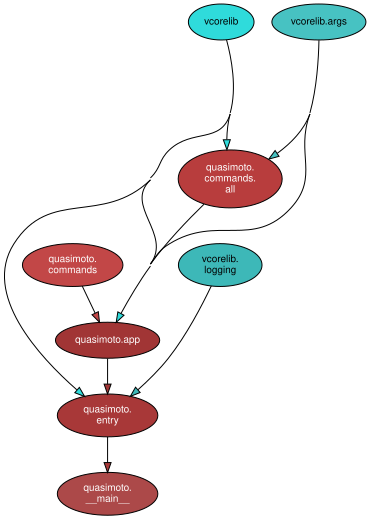

<!--
    =====================================
    generator=datazen
    version=3.2.4
    hash=a8b10f4623912f67d7186580098a37b6
    =====================================
-->

# quasimoto ([0.2.2](https://pypi.org/project/quasimoto/))

[](https://pypi.org/project/quasimoto/)

[](https://codecov.io/github/libre-embedded/quasimoto)


*A lossless audio generator.*

Consider [sponsoring development](https://github.com/sponsors/libre-embedded).

([interface documentation](https://libre-embedded.github.io/python/quasimoto))

## Python Version Support

This package is tested with the following Python minor versions:

* [`python3.13`](https://docs.python.org/3.13/)
* [`python3.14`](https://docs.python.org/3.14/)

## Platform Support

This package is tested on the following platforms:

* `ubuntu-latest`
* `macos-latest`
* `windows-latest`

# Introduction

# Command-line Options

```
$ ./venv3.14/bin/quasimoto -h

usage: quasimoto [-h] [--version] [-v] [-q] [--curses] [--no-uvloop] [-C DIR]
                 {gen,noop} ...

A lossless audio generator.

options:
  -h, --help     show this help message and exit
  --version      show program's version number and exit
  -v, --verbose  set to increase logging verbosity
  -q, --quiet    set to reduce output
  --curses       whether or not to use curses.wrapper when starting
  --no-uvloop    whether or not to disable uvloop as event loop driver
  -C, --dir DIR  execute from a specific directory

commands:
  {gen,noop}     set of available commands
    gen          generate audio
    noop         command stub (does nothing)

```

# Internal Dependency Graph

A coarse view of the internal structure and scale of
`quasimoto`'s source.
Generated using [pydeps](https://github.com/thebjorn/pydeps) (via
`mk python-deps`).


